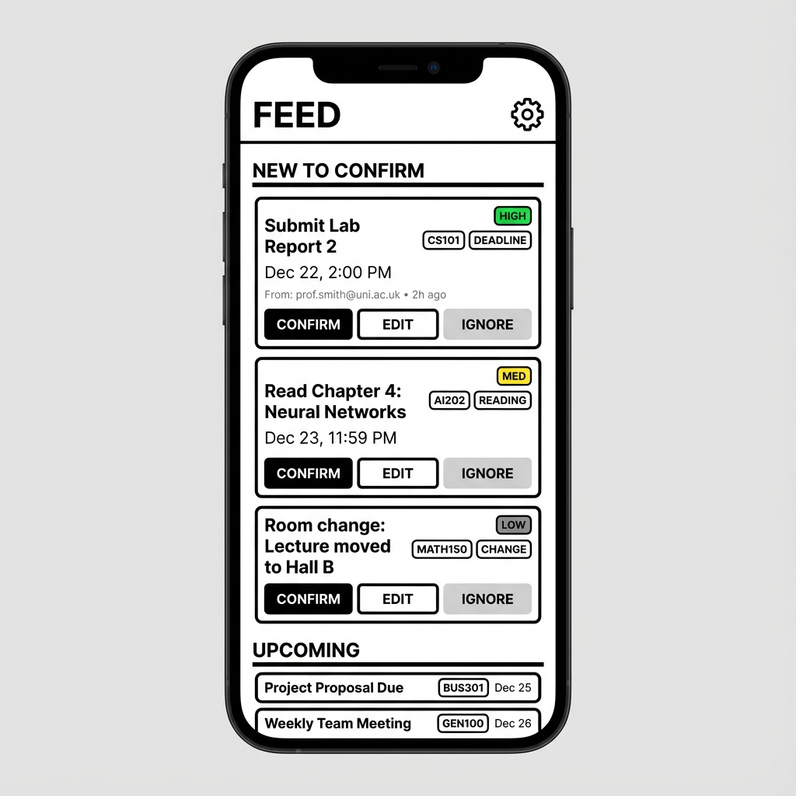
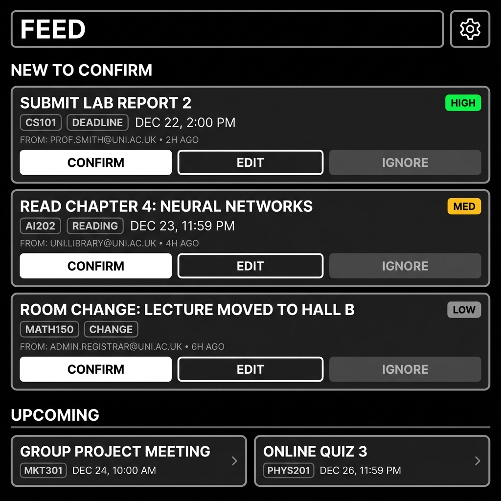

# StudentOS Design Mockups

These mockups showcase the Digital Brutalism design system for StudentOS Phase 1.

## Design Principles

- **Structure over decoration**: Utilitarian, productivity-first
- **High contrast**: Bold borders, strong typography
- **Rectangular geometry**: Sharp edges, minimal rounding
- **Fast comprehension**: Everything scannable in <3 seconds

## Screens

### Action Feed (Light Mode)

### Action Feed (Dark Mode)

### Edit Task (Light Mode)

## Notes

Additional mockups (Edit Task Dark, Thread Views, Connect Email, Settings) will be generated and added here.

The React Native prototype in `/mobile` implements these designs with interactive confirm/edit/ignore actions.
